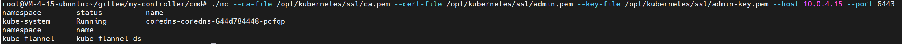
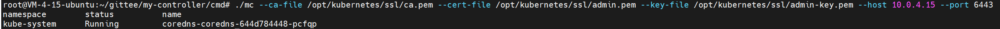

# MyController

#### 介绍

基于client-go实现对k8s集群的访问，实现了一个简易的controller

1. v0.1.0: 实现使用证书实例化RESTClient并访问apiserver，打印环境上kube-system命名空间下的pod
2. v0.1.1: 实现使用证书实例化ClientSet并访问apiserver，打印环境上kube-system命名空间下的pod和kube-flannel下的ds
3. master: 实现一个简易的controller。
- 如果一个pod包含标签"mycontroller:mycontroller"，就为pod增加一个新label"processed:processed"
- 如果更新已存在pod内容，删除了标签"mycontroller:mycontroller"就需要将"processed:processed"标签清除
- 如果更新已存在pod内容，增加了标签"mycontroller:mycontroller"就需要将"processed:processed"标签添加

#### 使用教程

```shell
cd cmd
go mod tidy
go build -o mc
# 指定自己的apiserver的ip与端口，指定证书与密钥
./mc --ca-file /opt/kubernetes/ssl/ca.pem --cert-file /opt/kubernetes/ssl/admin.pem --key-file /opt/kubernetes/ssl/admin-key.pem --host 10.0.4.15 --port 6443
```

##### master

###### 1. 启动 mycontroller
首先启动编译成功的controller二进制，会先读取我环境上已有的两个pod，coredns和flannel。当然这两个pod没有”mycontroller:mycontroller“，
所以他们不是这个controller的目标pod。会跳过处理。


###### 2. 测试所用的pod定义
在环境上创建两个pod，一个包含”mycontroller:mycontroller“标签，一个不包含。pod的定义如下


###### 3. 创建不包含”mycontroller:mycontroller“标签的pod
创建”busybox-no-label“pod之后，controller的日志显示这个pod不是这个controller所期望的目标pod。
创建这个pod之后，add事件会触发一次。update事件被触发了三次。猜测是有其他的controller修改了pod资源。
这个controller会正确的处理这个情况。


###### 4. 创建包含”mycontroller:mycontroller“标签的pod
创建”busybox-with-label“pod之后，controller的日志显示这个pod是这个controller所期望的目标pod。
在add事件中，pod被增加到工作队列中并且受到处理，但是因为资源被修改出现更新失败。
触发的三次update事件会因为资源被修改出现更新失败的情况。 资源更新失败后，pod会被再次放到工作队列中。
然后资源会被更新成功。
更新成功后，pod再次触发更新事件，所以“no need process”会再次打印一次。


查看”busybox-with-label“pod之后，可以看到”processed:processed“的label有加上了。mycontroller执行成功了


###### 5. 为不包含标签的pod增加标签
执行以下命令将标签加上


查看controller日志。可以看到出发了update事件。并且处理成功了。
更新完成后会再次触发update事件，但是updatePod会跳过，因为pod已经是期望的状态了


查看busybox-no-label的pod的内容，可以看到pod增加了标签”processed:processed“


###### 5. 包含标签的pod移除标签
执行以下命令

```kubectl label po busybox-with-label mycontroller-```

controller日志显示,只触发了update事件并且更新成功


查看busybox-with-label的pod的内容，可以看到pod中的标签”processed:processed“删除了

###### 6.删除busybox pod
执行以下命令


controller日志显示触发了delete事件，两个pod被删除了


##### V0.1.1

可以看到环境上的pod与ds已经打印出来了


##### V0.1.0

可以看到环境上的pod已经打印出来了

